# Course Materials RAG System

A Retrieval-Augmented Generation (RAG) system designed to answer questions about course materials using semantic search and AI-powered responses.

## Overview

This application is a full-stack web application that enables users to query course materials and receive intelligent, context-aware responses. It uses ChromaDB for vector storage, Anthropic's Claude for AI generation, and provides a web interface for interaction.


## Prerequisites

- Python 3.13 or higher
- uv (Python package manager)
- An Anthropic API key (for Claude AI)
- **For Windows**: Use Git Bash to run the application commands - [Download Git for Windows](https://git-scm.com/downloads/win)

## Installation

1. **Install uv** (if not already installed)
   ```bash
   curl -LsSf https://astral.sh/uv/install.sh | sh
   ```

2. **Install Python dependencies**
   ```bash
   uv sync
   ```

3. **Set up environment variables**
   
   Create a `.env` file in the root directory:
   ```bash
   ANTHROPIC_API_KEY=your_anthropic_api_key_here
   ```

## Running the Application

### Quick Start

Use the provided shell script:
```bash
chmod +x run.sh
./run.sh
```

### Manual Start

```bash
cd backend
uv run uvicorn app:app --reload --port 8000
```

The application will be available at:
- Web Interface: `http://localhost:8000`
- API Documentation: `http://localhost:8000/docs`

## Architecture & Data Flow

```mermaid
graph TD
    A["👤 User Frontend<br/>HTML/CSS/JavaScript"] -->|Enters Query| B["🌐 FastAPI Backend<br/>app.py"]
    
    B -->|1. Route Query| C["RAGSystem<br/>Main Orchestrator"]
    
    D["📚 Course Documents<br/>docs/ folder"] -->|Load & Process| E["DocumentProcessor<br/>Chunking & Preprocessing"]
    E -->|Store Chunks| F["VectorStore<br/>ChromaDB"]
    
    C -->|2. Search| F
    F -->|3. Return Relevant Context| C
    
    C -->|4. Add History| G["SessionManager<br/>Conversation Memory"]
    G -->|5. Retrieve Chat History| C
    
    C -->|6. Generate Response| H["AIGenerator<br/>Anthropic Claude API"]
    H -->|7. Stream Response| C
    
    C -->|8. Return JSON| B
    B -->|Display Answer| A
    
    style A fill:#e1f5ff
    style B fill:#fff3e0
    style C fill:#f3e5f5
    style D fill:#e8f5e9
    style E fill:#e8f5e9
    style F fill:#fce4ec
    style G fill:#f1f8e9
    style H fill:#ede7f6
```



### Component Details

| Component | Purpose |
|-----------|---------|
| **RAGSystem** | Orchestrates the entire query pipeline |
| **DocumentProcessor** | Chunks course materials into searchable segments |
| **VectorStore** | Stores embeddings in ChromaDB for semantic search |
| **AIGenerator** | Interfaces with Claude API for answer generation |
| **SessionManager** | Maintains conversation history for context |
| **ToolManager** | Abstracts search tools for flexible integration |

### Data Flow Steps

1. **User Query**: User submits a question via the web interface
2. **Backend Processing**: FastAPI routes the request to RAGSystem
3. **Semantic Search**: VectorStore performs semantic search across stored chunks
4. **Context Retrieval**: Relevant course materials are retrieved (max 5 results)
5. **Conversation History**: SessionManager provides prior conversation context
6. **AI Generation**: Claude processes query + context + history to generate answer
7. **Response**: Answer is streamed back to frontend and displayed

